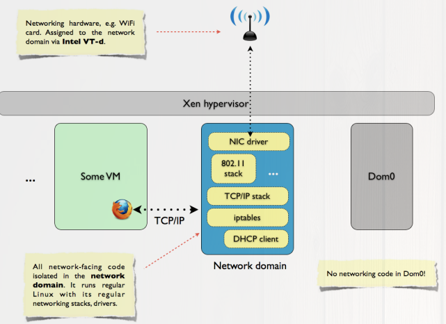

# QubeOs: Un Sistema Operativo confiable

SO centrado en la seguridad personal del usuario sobre todo a la hora de ejecutar untrusted code.
\vskip 0.2in
Memoria creada para la asignatura de __Seguridad__, Master IOT (UCM)

\vskip 0.5in

\vskip 0.5in

## Alumnos
    SERGIO SEMEDI BARRANCO   <ssemedi@ucm.es>
    LUCAS SEGARRA FERNANDEZ  <lsegar01@ucm.es>
### Presentación: http://slides.com/master_iot/qube

\newpage
## INDICE

\vskip 0.4in

* ¿Que es? .............................3

    * Importancia .....................3

    * Problema SOs actuales ...........4

    * Por que? .........................5

* Hypervisores ..........................6

    * Detalles Técnicos XEN - KVM ....7

    * Aspectos relevantes ...............9

* Arquitectura QUBEOS ................10

* Dominios ..............................11

    * APPVM ..........................12

    * STORAGE .......................13

    * NETWORKING ..................15

    * GUI ..............................17

* Caso de Uso ...........................19

* Reflexión Final ........................21

* Fuentes ................................22


\newpage
## ¿Qué es QubeOs?
 QubeOS es un sistema operativo orientado a la seguridad. Es un _free and open-source_, es un SO Desktop (personal use) que aprovecha el aislamiento de un hypervisor baremetal como puede ser el Proyecto libre Xen + IntelVd (hardware)

### Importancia

El sistema operativo es una de las piezas claves de la informátia en genera, este es el encargado que ejecutar todos los programas en un ordenador y de controlar del Hardware.

En estos tiempos conceptos como Cloud, Internet of Things o Big Data son muy recurrentes, al final todos estos términos no dejan de ser cambios de paradigma que no afectan en mucho a las técnicas de seguridad normalmente usadas hasta ahora.

Hablando entonces del máximo exponente que vamos a querer proteger en cualquier sistema informático es el SO.
Aprovecharemos QUBEOs para hacer una pequeña introdución a tendencias de seguridad en arquitecturas de sistemas Operativos.

Esta clase de tecnologías/sistemas son bastante comunes en la actualidad, como hemos dicho siendo muy parecido a lo que puede llamarse por ejemplo la infraestructura cloud que hará de controlador de todos nuestros dispositivos iot.
```
ejemplo:

        Cluster de maquinas físicas conectadas en LAN
        con hypervisores instalados junto a un frontend

        para proveer un servicio de cloud público donde
        podrás enganchar dispositivos IOT.

        Puede ser este el ejemplo de marcas como AWS, Azure o IBM Cloud
```

Clave en cierta medida para la seguridad => Software libre (Community based).

\newpage
### Problemas de los sistemas operativos actuales

Los sistemas operativos más populares para informática de escritorio, como Windows Mac OS X o los basados en GNU/Linux resultan insatisfactorios en cuanto a la seguridad. El principal problema es su inhabilidad para proporcionar aislamiento efectivo entre distintos programas ejecutandose en la misma máquina.


Por ejemplo si el _web browser_ del usuario se ve comprometido el sistema operativo suele tener dificultades para proteger otras aplicaciones y datos de ser verse igualmente comprometidos. Análogamente, si algún componente del nucleo del sistema se ve comprometido (driver wifi) ninguno de los OS que mencionamos en el parrafo anterior puede defenderse de un compromiso total de las aplicaciones y datos del usuario.

Tal situación es el resultado directo de algunas decisiones de diseño arquitectónico, que incluyen sobrecomplejitud de la API del OS, diseño inseguro de interfaces gráficas y la arquitectura monolítica del kernel.

Parece más sencillo conseguir cierto aislamiento entre algunos de los procesos y datos del usuario que pretender solucionar todos los posíbles bugs y vulnerabilidades de cualquier sistema.


\newpage
#### Por que Qube OS respecto a lo clasico (kernel monoliticOS)
Estamos acostumbrados a los trending OSs que vienen hasta preinstalados en hardware y ya compilados (algunos casos) en el que solo tienes el binario, además la arquitectura monolítica del Os no facilitan las labores de seguridad:


Esto es debido a la complejidad que supone esta (observar foto arriba). En este diseño el SO tiene pleno control y existen zonas separadas, a simple vista el Kernel (interactua HW) y userLand (donde el usuario actua y ejecuta) una forma de ver esto es desde el punto de vista de las llamadas al sistema (syscall) que invocara el usuario cuando necesite ciertas labores de privilegio.
Sabiendo esto es facil de predecir que esta fina barrera puede suponer problema a la hora de hablar de seguridad.

Ejemplos punto de entrada:
```
           Correo
           Navegacion no deseada
           Nic -> Wifi
           Vulnerabilidades Software
```


\newpage
## Introducción basica hypervisores

Hypervisor es software, firmware or hardware que permite la creación de maquinas virtuales.
Desde el punto de vista de arquitectura de sistemas operativos 'seguras'es casi la parte mas importante de esta, hablando de QubeOs ya que la seguridad esta orientada al aislamiento y por lo tanto tendremos a un hypervisor por encima.

Estos hypervisores rapidamente podriamos distinguirlos en dos formas:

* bare metal: Actuan sobre el propio HW
* hosted: Estan por encima del SO


Desde el punto de vista de la seguridad interesa **bare metal** en esta memoria vamos a tratar KVM y XEN como ejemplos principales de como funcionan los hypersores centrandonos finalmente en este último (XEN).

\newpage
####  detalles tecnicos comparativos XEN - KVM

Estos hypervisores son __bare metal__ y son los que nos van a interesar a la hora de hablar de seguridad. Esta razón es simple, como hemos visto en el diagrama anterior los de tipo hosted nos brindan una capa de abstracción mas sobré la virtualización, el SO anfitrión sigue controlando todo y este punto no nos interesa (sin meternos en ningún término de rendimiento).

XEN Y KVM son hypervisores bare-metal, en KVM aprovechamos la arquitectura monolítica que nos brinda Linux para tener un modulo en el kernel interactuado con qemu (emulador) con XEN por el otro lado usamos otras 'tecnologías' o técnicas como puede ser microkernel o paravirtualización.

##### KVM
\vskip 0.3in


Gracias a el modulo KVM este hypervisor es baremetal ya que permite la interación directa con hardware, gracias a QEMU puede realizar la emulación. El problema de este hypervisor en cuanto a seguridad se refiere reside en que básicamente seguimos teniendo el mismo problema del kernel monolítico, las maquinas virtuales en este caso siguen siendo user process manejados por el scheduler de linux, al igual que la interacción kvm - qemu.

##### XEN

\vskip 0.3in


En el caso de Xen este hypervisor nos interesa más, sigue un diseño microkernel, aunque parezca que este hypervisor simplemente va a ganar a KVM por no usar Linux vanila como base esto es erróneo, ya que Xen aunque no lo parezca también tiene que hacer uso de un sistema Linux.

\newpage

**Características**

Sin embargo desde el punto de vista seguro Xen nos brindará ciertas características importantes:

    * small footprint, interface -> microkernel design
        Muy interesante debido a que nos interesa tener un software pequeño.

    * Linux based (Linux system running as dom0)
        Podemos aprovechar Linux como main control stack de Xen.

    * Driver isolation: main device driver for a system to run inside of a virtual machine
        Esta es la característica mas importante ya que nos permite separar un driver
        principal de las VMs.

    * Paravirtualization: Fully paravirtualized guests
        Nos interesa desde el punto de vista del rendimiento y aprovechamiento HW.

\newpage
## Arquitectura QUBE OS orientada seguridad

QubeOs entonces es un sistema operativo que utiliza tecnologías como las ya habladas previamente, como puede ser XEN/arquitectura de dominios junto con Intel VTx (Hardware).

Implementa una estrategia de seguridad por aislamiento y compartimiento, con este SO podemos entonces separar de forma optima varias 'aplicaciones' de uso personal totalmente aisladas unas de otras creando así una capa de seguridad robusta.

Esto en gran parte lo conseguimos gracias al funcionamiento de Xen y la capacidad de llevar main device drivers (responsables de controlar HW) a dominios particulares como podemos ver en la siguiente imagen.


- Networking subsystem (IOMMU/VT-d).
- Storage subsystem
    - USB y Drivers parecdos aislados en una maquina virtual sin privilegios.
- Graphics
- User Apps/VMs

Esto hace que comprometer cualquiera de los sistemas aislados no suponga un peligro real global para el SO.

\newpage
## Dominios

#### AppVM

Aplicaciones directas para el usuario que podrá usar como quiera, cada una tiene su espacio de dominio aislado.
Ahorro de Disco based, las aplicaicones pueden compartir un FS RO.

Para separar cualquier tipo de problema relacionado con el FS tenemos el Storage domain.

#### storage

QubeOs siempre tratará de hacer un uso del disco (hardware) óptimo, empleara técnicas como pueden ser un Copy-on-write Filesystem.

Esta clase de arquitectura es insegura de tener en el dominio administrativo.

Tiene acceso al controlador de disco/USB o CD/DVD.

#### GUI X

Este dominio accede directamente a los graficos del dispositivos y además IO como puede ser el raton o el teclado.
Sera por lo tanto el encargado de lanzar un Servidor X.

Qube OS Usa un app viewer que te permite interactuar con el X server de forma independiente para cada AppVM.

Este dominio es muy importante a nivel de ser comprometido por lo tanto **no debería ejecutar código externo**.

#### networking,

Aqui encontramos lo referente a la parte de redes (drivers NICS, stacks de protocolos como 802.11, tcp/ip...).
Interactua con las NICs físicas mediante un dominio (network domain) sin privilegios, todo gracias a Vt-d.

\newpage
## Dominio APPVM

Este dominio es usado para hostear las aplicaciones del usuario, basicamente las tareas que vamos a realizar del sistema operativa serán aqui.

Esto se realiza gracias a los demás dominios que nos ayudaran a la hora de realizar diversas acciones como pueden ser conectarnos con el exterior, usar espacio de disco duro de forma eficiente o poder renderizar sobre tu pantalla de forma óptima

Todo esto introduce cierta complejidad a la hora del diseño de este SO, pero gracias a ella por otra parte tendremos la capa de seguridad necesaria.

\vskip 0.3in


\newpage

## Dominio STORAGE


\vskip 0.3in
Este dominio va a tener la capacidad de controlar el sistema de ficheros de nuestro SO.
Debido a las APPVMs tener un sistema de ficheros para cada maquina no sería para nada optimo, es aqui donde entra en juego el storage domain.

Debido a lo vulnerable que puede llegar a ser un SO es importante que el dominio de almacenamiento no tenga privilegios.

Este dominio tendrá control sobre los dispositivos de almacenamiento como pueden ser USB, CD/DVD.
Para resolver el problema de seguridad de este dominio y su comunicación con los restantes QUBEOS lo resuelve usando criptografia para proteger el FS. De esta forma el propio dominio de almacenamiento no puede leer datos confidenciales de otros dominios.

\newpage

#### Compartiendo / entre todas las aplicaciones.

En QubeOs se van a poder poder tener varias aplicaciones aisladas gracias a XEN, pero en terminos de File System esto no puede ser muy rentable  por eso QubeOs intenta resolver este problema de dos formas:


* teniendo un root FS (/) que se va a compartir entre todas las APPS (ej: /boot, /bin, /usr)
* datos privados separados en cada app (/home, /usr/local...).

Sin embargo esta separación que hemos propuesto no es un problema tan facil de resolver en Linux ya que es muy facil que falle si tiene que utiizar partes del FS importantes que solo son read only. Para solventar este problema se usa el __device mapper__ (dm, Linux 2.6) para crear un sistema copy-on-write (COW).


\newpage
## Dominio NETWORKING



Este dominio es un dominio muy "delicado" hay que tener en cuenta que la base principal de ataques a cualquier ordenador puede ser directamente la red, ya sea por medio de una LAN privada o directamente internet.

Las pilas de redes son complejas (TCP/IP) y comprometer algún punto es una situación de riesgo bastante crítica del So ya que la tarjeta de red un cualquier ordenador la suele manejar el propio kernel. Es por eso por lo que QUBEOS crea este dominio de networking no privilegiado donde almacenaremos los drivers relacionados con neworking (NICS, 802 11, TCP, Firewalling...).

\newpage
#### Inter-Vm networking

Cada dominio app del usuario usa una tarjeta de red virtual (XEN) como eth0 que se conectará al network domain:


    AppVM1 |eth0 <--------->vif1.0| network domain <Drivers/NAT>|REAL NIC <---> Internet

Gracias a que el dominio no privilegiado y a la propiedad no inter-vm networking en caso de que nuestro dominio de redes se viera comprometido asegurariamos todas las maquinas restantes.


\newpage
## Dominio GUI


Este dominio esta dedicado como su nombre indica a la interfaz gráfica, un elemento en todo software de lo mas delicado.

Este dominio es de empezar importancia, se podría decir que despues del propio hypervisor (XEN) este dominio es la última parte de el SO que quieras que se vea comprometida ya que si el usuario adquiere control sobre este subsistema __si__ que podría interactuar con cualquier aplicación del usuario.

Una discusión importante de este dominio es si debe tener privilegios o no, en el caso de QUBEos finalmente esto caerá sobre el domnio administrativo de Xen (Dom0) que tiene privilegios, esto es debido a que aunque hiciesemos un dominio aislado como en los casos anteriores, al resultar algo tan delicado como puede ser la GUI el atacante estaría comprometiendo todas las VMs igualmente.

\newpage
**Funcionamiento:**

* Existe un Appviewer al que puedes mandar notificaciones sobre nuevas ventanes emergentes (virtual desktop).

* Appviewer recibe notificaciones sobre cualquier cambio.

* Manejo de Focus, basicamente permite al usuario cambiar libremente de ventana en dominios diferentes.

* Se encarga del manejo de interrupciones IO como pueden ser el ratón o el telcado.

\newpage
## Caso de Uso

Enfocado desde el punto de vista del usuario presentamos una visión práctica del modelo de seguridad de Qubes OS.

Las máquinas virtuales (en adelante VMs), también llamadas dominios, son los _bloques de construcción_ primarios en el modelo de seguridad de Qubes OS, la tarea principal del sistema operativo consiste en aislar las VMs entre ellas, de tal forma que aunque una se viera comprometida, las demás seguirían siendo seguras de utilizar. Consideramosm para un ejemplo práctico, que evidencia como podría esto contribuir a mejorar la seguridad de cualquier usuario, las siguientes VMs (dominios) definidas por el usuario.

- La __Random VM__ utilizada para la navegación típica web, buscar en Google, leer noticias, ver vídeos etc. El usuario tambiém usaría esta máquina para instalar aplicaciones en las quizá no pueda confiar completamente pero quiera probar como algunos juegos. La principal característica de esta VM es que __no contiene niguna información sensible__, con lo que su potencial compromiso supone ningún problema de seguridad para el usuario. En cualquier momento el usuario puede simplemente reiniciarla y Qubes haría seguro reverirla a un estado bueno conocido.
- __Social VM__ utilizada por ejemplo para albergar un cliente de email para su uso personal (no corporativo), para actualizar su blog privado,twitter, facebook o cualquier otro _servicio web social_. El denominador común de todo lo que el usuario haga en esta máquina, es que __están todas conectadas__ con la _identidad online_ del usuario. Es probable que si un atacante se hiciera control sobre la cuenta de email del cliente por ejemplo, _ganase_ fácilmente el control de la cuenta de twitter etc. Consecuentemente con la dependencia de todas estas aplicaciones de los mismos datos sensibles, la _identidad social del usuario_, no hay razón para separarlas entre ellas, siendo razonable albergarlas en la misma VM.
- __Shopping VM__ utilizadad para todas la compras por internet, amazon, ebay, etc. El __recurso sensible común es el número de tarjeta del usuaurio__ en este caso. Y posiblemente la dirección, telefono y nombre del usuario. Si el número de tarjeta fuese _robado_ por alguna de las páginas de venta ya estaría comprometida, por lo que el hecho de que otro página pudiera robarlo luego es completamente irrelevante. No hay razón para separar las actividades de compra en Amazon de las realizadas en una pequeña tienda local si el usuario utiliza la misma tarjeta en los dos sitios. A lo mejor un usuario más paranoico preferiría utilizar dos tarjetas de credito diferentes para distintos tipos de compras, una con un límite bajo para las compras comunes, pedir comida, comprar libros etc, y la otra con un límite más alto para otro tipo de gastos más caros. En tal caso si que podría tener dos máquinas __Shopping VM low__ y __Shopping VM hig__, en los países más desarrollados, el seguro generalizado de transacciones con tarjetas de crédito haría que tal esfuerzo no mereciese la pena.
- __Bank VM__ utilizada exclusivamente para acceder a su banco. __Permtiendo exclusivamente acceso HTTPS__ a la web del banco, y nada salvo eso.
- __Corporate VM__ utilizada para albergar el cliente de correo de la empresa, acceder a la intranet corporativa. Así que esta máquina tendría un cliente VPN, y __pernite únicamente conexiones al VPN gateway corporativo__. Aquí es también donde se almacenan y utilizan los ficheros relacionados con el trabajo del usario, como informes, hojas de cálculo, bases de datos, etc. Esta máquina también podría verse comprometida si por ejemplo un compañero de trabajo enviáse al usuario un PDF infectado que explote una vulnerabilidad del visor de PDF que utilice el usuario, Qubes no detendría que esa _explotación_ se hiciese con toda la VM pero si le impediría hacerse con otras. En cualquier caso parece probable que en tal situación los secretos de la VM de la organización se viesen comprometidas en cualquier caso, porque el colega tiene una máquina comprometida, así que si trabajan en el mismo equipo, en el mismo proyecto, todos los documentos relacionados con el proyecto se verían comprometidos en cualquier caso. Un usuario que interactuara con más de un equipo, o más de un departamento necesitaría probablemente definir más de una VM corporativa.

Esto es solo un ejemplo de TODO TERMINAR

\newpage
## Reflexión final.

QubeOs es un sistema operativo razonablemente seguro, que juntando varias tecnologias consigue ser una optativa bastante deseable en cuanto a cualquier uso informático orientado a Desktop se refiere.
En la informática el SO suele ser la parte mas delicada de cualquier sistema, con el avance tan rápido que tiene toda la tecnología en general es de esperar de que tendencias más clásicas como puede ser la arquitectura de Sistemas operativos normales, los antivirus o los firewalls __no valen__.


Aunque en un principio este documento se centre en la seguridad personal (Desktop), es importante entender que en el mundo en el que vivimos actualmente sobre los CPD que podemos encontrar en cualquier empresa encontraremos una arquitectura 'similar' a la que tiene QUBEOS aunque en vez de aplicarlo a un solo ordenador y SO esto se aplique mas a un gran Cluster y a muchos ordenadores (ej: CPD que usa docker-machine y docker para tener mas de 100 aplicaciones conectadas entre sí), el IOT por lo tanto juega un papel bastante importante en todo esto ya que aunque sea importante proteger cualquier dipositivo esta claro que la parte mas importante y delicada siempre la tendremos en el __cloud__.


\newpage
## Fuentes:

- Wikipedia.com

- qubes-os.org

- Manual pdf arquitectura QUBE OS

- Hacker News

- doc.opensuse.org/documentation/leap/virtualization/html/book.virt/cha.kvm.intro.html

- researchgate.net/figure/Xen-architecture-29_fig4_261411692

- wiki.xen.org/wiki/Xen_Project_Software_Overview
