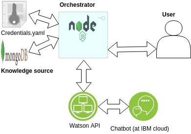
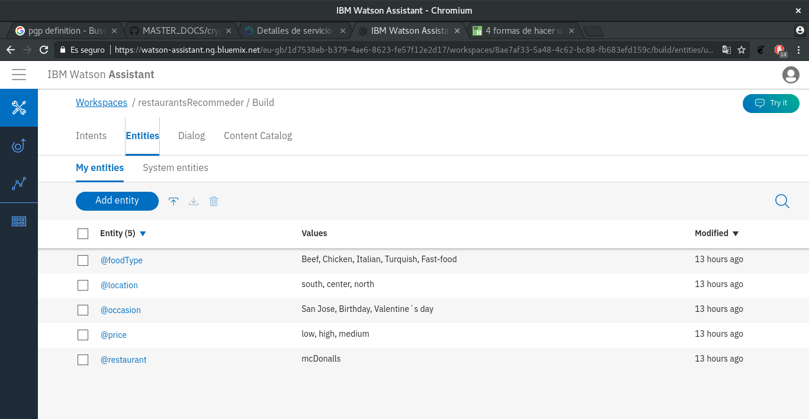
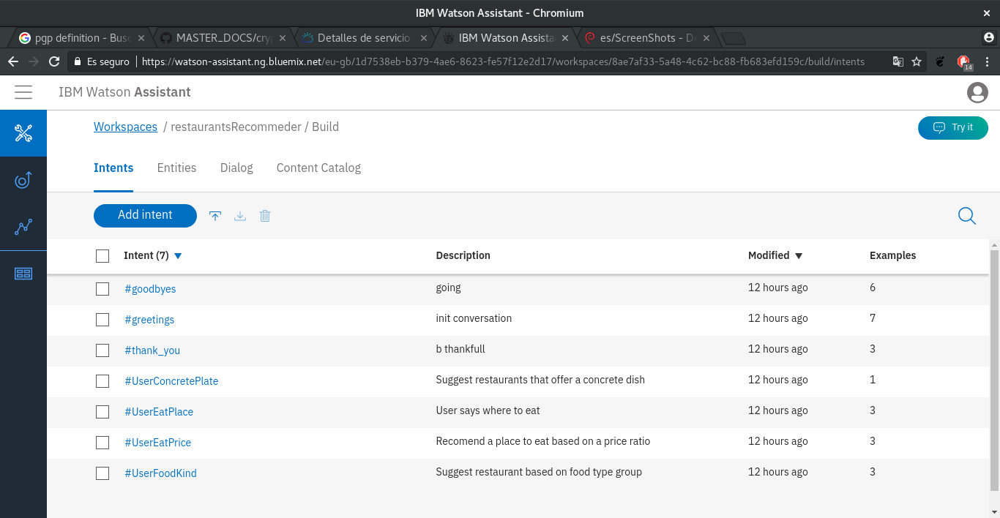
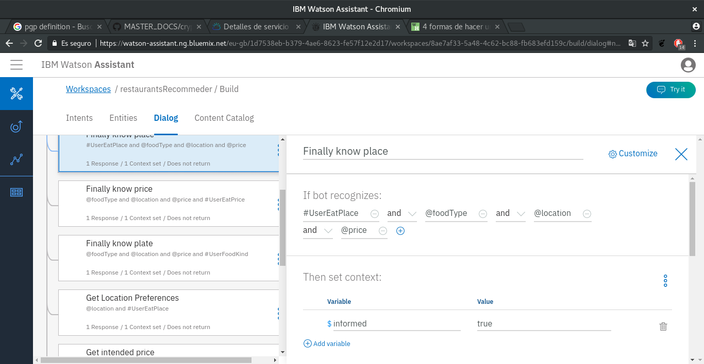
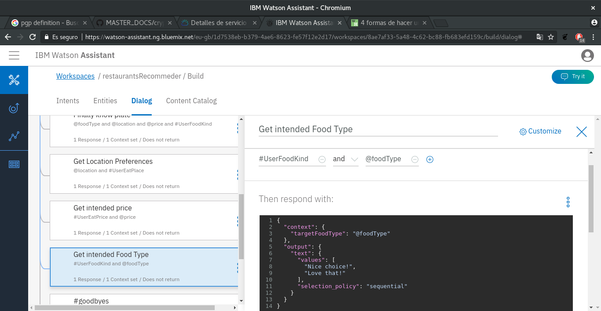
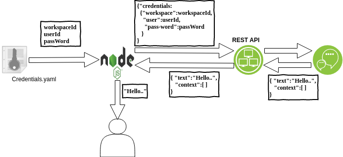
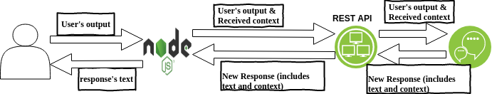
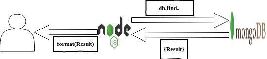

# Memoria chatbot con Watson

\newpage

## Indice

* prueba
* prueba
* prueba
* prueba
* prueba

\newpage

## Resumen

Esta memoría es el resultado de una práctica de Inteligencia Artificial del Master de Internet de las cosas (UCM). En ella detallamos el proceso de creación de un bot básico con las siguientes tecnologías:

* IBM Watson (PAS)
* NodeJS (Backend)
* Mongodb (Storage)
* pgp (Credentials Encryption)

Por desgracía entendimos tarde la participación individual de la práctica, por lo tanto y aunque en un principio el trabajo fuera único se ha decidido que:

* Se ampliara el trabajo para la realización de dos bots partiendo del primer desarrollo.
* Se ampliara el trabajo para la realización de dos memorias que tendrán una parte común partiendo de la primera.
* El resultado final serán 2 aplicaciones con una infrastura similar que es la que hemos probado y aprendido juntos de entre las que ofrece IBM

Se da además la circunstancia de que uno de nosotros está haciendo prácticas en IBM por lo que no nos ha sido difícil informarnos de como integrar un bot en una infraestructura, la [solución](https://console.bluemix.net/docs/services/conversation/develop-app.html#building-a-client-application) que se nos propuso, consiste en implementar un orquestador, que básicamente es un cliente del bot, que a través de una API que ofrece IBM Watson para cada bot, identificándolo con el _workspaceId_, _clientId_ y _password_, gestiona la comunicación entre el usuario y el bot, recibiendo de este además toda la información asociada al procesamiento del lenguaje (parámetros del parrafo anterior) reconocida por el mismo.

Consideramos que el objetivo de la práctica consistía en desarrollar un chatbot cada uno, y la parte común de ambos trabajos se limita a la investigación y desarrollo de la aproximación que mencionamos en el parrafo anterior. En cuanto a la parte característica de cada uno, toda la información relativa al diseño y entrenamiento de cada bot, que se explica en el apartado de desarrollo de cada memoria.

#### Alumnos implicados

* Lucas Segarra Fernández
* Sergio Semedi Barranco

\newpage

## Desarrollo

Durante el desarrollo de nuestra primera versión (conjunta) del mismo, un recomendador de restaurantes, se nos ocurrió la posibilidad de utilizar una fuente de conocimiento externa a Watson en la que poder hacer consultas utilizando los parámetros (entidades,intenciones, variables etc) identificados por el bot. De otro modo, tendríamos que governar el hilo de la conversación desde el bot, o tener un número de ramas que no consideramos escalable.

En nuestro caso leeremos dichas credenciales de un fichero en formato _yaml_ cifrado con _pgp_.

De esta forma, ese mismo orquestador puede, cuando ya haya identificado las intenciones y preferencias del usuario (en el caso de los restaurantes precio, tipo de comida, localización etc del restaurante a recomendar) utilizarlas para consultar en cualquier fuente de conocimiento, notros utilizamos una base de datos en _Mongo_, para dar la información final, (por ejemplo mostrar al usuario un restaurante que se ajusta a las características que este ha manifestado).

### IBM Watson

#### Infraestructura

\newpage

Esta aproximación es independiente al chatbot y fuente de conocimiento que se utilicen, y aunque finalmente vamos a entregar una práctica cada uno, como la invesigamos juntos y la vamos a utilizar en ambas prácticas, consideramos más honesto entregar esta parte de la memoria común.

\newpage

#### Configuración y entrenamiento del chatbot

Accederemos a través de la API de Watson a nuestro bot la interacción del mismo con nuestro _orquestador_, depende de como hayamos configurado al primero en la web GUI.

Dicha interfaz permite la definición de __entidades__ que representan conceptos relacionados con la temática del bot y facilitan su reconocimiento por parte de éste. La plataforma tambén ofrece la posibilidad de utilizar entidades _del sistema_ como tiempo, números etc.

Para facilitar la detección de las intenciones del usuario, y la _clusterización_ que el servicio hará de la interacción con aquel, definimos __intends__ cada uno de los cuales se corresponde con una posible intención del usuario (i.e. saludar).

Definidos intenciones y entidades, se definen nodos de __diálogo__ para determinar la respuesta y tratamiento del servicio las entidades e intenciones reconocidas. Una vez configurado el diálogo, se procede al __entrenamiento__ del bot para guiarlo y facilitar la _clusterización_ que mencionamos previamente.

\newpage

#### Características particulares del recomendador de restaurantes

Este apartado recoge la información relativa al bot desarrollado con dicho objetivo y que se va a entregar como tal parte en la solución de Lucas Segarra.

Para realizar la recomendación el servicio recogerá las preferencias del usuario en cuanto a precio, localización y tipo de comida que ofrece el restaurante.

Configuramos una base de datos en la que intrujimos restaurantes (incluyendo tal información de los mismos) que hemos utilizado como __fuente de conocimiento__.

En cuanto a las __entidades definidas__, utilizamos una para cada uno de los tres parámetros que utiliza el bot para hacer la recomendación.

\newpage

Las __intenciones del usuario__ que pretendemos reconocer, son manifestaciones del mismo sobre sus preferencias para tales parámetros.

\newpage

La estructura del __diálogo__ es plana y los _nodos de salida_ están definidos en las posiciones superiores para que sean los primeros con los que se haga el _matcheo_, no necesitamos que sean hijos de otros nodos porque envíamos desde el cliente el contexto reconocido por el bot. Para ello, en el resto de nodos, damos desde el bot valores a determinadas variables que envíamos al _orquestador_ en función de las entidades e intenciones reconocidas.

## Datapath

Como se menciona anteriormente la comunicación entre el usuario y el chatbot se realiza a través de el orquestador desarrollado en javascript. La API a la que nos referimos en todo este documento es de tipo REST y la información se intercambia en formato _JSON_.

1. Al comenciar la ejecución del programa se leen las credenciales (identificadores de _workspace_ y usuario y contraseña) del fichero _yaml_ y se envían a la API de Watson para iniciar la conversación con nuestro bot.

2. Si, en el diálogo diseñado para el bot, este inicia la conversación con el usuario, el orquestador recibe el texto de ese diálogo, se lo muestra al usuario y permanece a la espera de que este último introduzca alguna respuesta. También se recibe un contexto incialmente vacío que se incluirá en cada respuesta y se explica en el punto 4.

3. Cada respuesta que el usuario introduce en la interfaz del orquestador, este se lo retransmite al bot a través de la API, enviándo además del texto del mensaje el contexto que mencionamos en el punto anterior y vamos a replicar al bot en cada petición que hagamos.

4. Cada vez que el bot responde al usuario, el orquestador recibe de este un objeto con el texto de la respuesta, y un campo con la información de la entidades, intenciones y variables que este ha detectado en el diálogo a este momento. A parte de replicarle estas variables al bot (para que sepa en que rama y nodo estamos) las procesaremos en la lógica del orquestador para saber qué tenemos que consultar en la base de concimiento para mostrar al usuario y cuando hacer dicha consulta.

5. Los puntos 3 y 4 se repiten hasta que la aplicación ha recibido suficiente información para mostrarle al usuario el resultado de alguna consulta en su fuente de conocimiento.

6. Una vez realizada la consulta se ofrece su resultado al usuario y se procede a finalizar la conversación.

\pagebreak

### 1 y 2

Identificación de workspace y usuario y autenticación, y retransmisión del texto del primer mensaje al usuario.

### 3 y 4

Flujo de una conversación a través del orquestador.

\pagebreak

### 6

Identificación de los objetivos del usuario y consulta en base de conocimiento.

